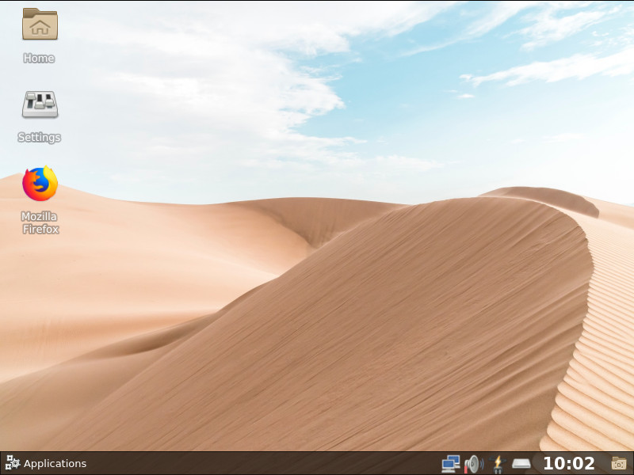

[](https://github.com/rodlie/draco/releases/latest)
[](https://travis-ci.com/rodlie/draco)

# Draco Desktop Environment

Draco is a simple and lightweight desktop environment.

### Default shortcuts

| Shortcut | Action |
| -------- | ------ |
| ``Alt+F1`` | Default terminal |
| ``Alt+F2`` | Application launcher |
| ``Ctrl+Alt+Left`` | Switch desktop/workspace |
| ``Ctrl+Alt+Right`` | Switch desktop/workspace |
| ``Ctrl+Alt+Up`` | Switch desktop/workspace |
| ``Ctrl+Alt+Down`` | Switch desktop/workspace |
| ``Shift+Alt+Left`` | Move window to desktop/workspace |
| ``Shift+Alt+Right`` | Move window to desktop/workspace |
| ``Shift+Alt+Up`` | Move window to desktop/workspace |
| ``Shift+Alt+Down`` | Move window to desktop/workspace |
| ``Win+F1`` | Switch to desktop/workspace 1 |
| ``Win+F2`` | Switch to desktop/workspace 2 |
| ``Win+F3`` | Switch to desktop/workspace 3 |
| ``Win+F4`` | Switch to desktop/workspace 4 |
| ``Win+D`` | Toggle show desktop |
| ``Alt+Tab`` | Next window |
| ``Alt+Shift+Tab`` | Previous window |
| ``wheel/touchpad up/down on desktop`` | Switch desktop/workspace |

## Requirements

Build and runtime requirements.
  * **``cmake``** *(>= 3.0)*
  * **``pkg-config``**
  * **``Qt``** *(5.5+, latest LTS recommended)*
    * ``QtCore``
    * ``QtDBus`` *(can be disabled, not recommended)*
    * ``QtGui``
    * ``QtWidgets``
    * ``QtConcurrent``
    * ``QtX11Extras``
  * **``X11``**
    * ``libX11``
    * ``libXdamage``
    * ``libXrandr``
    * ``libXfixes``
    * ``xrandr``
    * ``setxkbmap``
    * ``xinit``
    * ``xcb``
      * ``xcb-randr``
      * ``xcb-ewmh``
      * ``xcb-icccm``
      * ``xcb-image``
      * ``xcb-composite``
      * ``xcb-damage``
      * ``xcb-util``
      * ``xcb-shm``
  * **``powerkit``** *(Power management)*
  * **``qtfm``** *(Storage management)*
  * **``qt5ct``** *(Theme management)*
  * **``xdg-utils``**
  * **``shared-mime-info``**
  * **``hicolor-icon-theme``**
  * **``adwaita-icon-theme``** *(3.18 recommended, higher is broken)*
  * **``openbox``** *(Window manager)*

## Recommended

  * **``qterminal``** *(Terminal emulator)*
  * **``pnmixer``** *(Audio manager)*
  * **``obconf``** *(window manager config)*

## Build

### Slackware Linux (14.2+)

Install the following packages from [SlackBuilds.org](http://slackbuilds.org) or [slackware.com/~alien](http://www.slackware.com/~alien/slackbuilds/):
 * qt5 *(5.9.7+ recommended)*
 * qt5ct
 * openbox
 * powerkit
 * qtfm

 The rest should be available in a standard installation.

```
mkdir build && cd build
cmake -DCMAKE_INSTALL_PREFIX=/usr -DCMAKE_INSTALL_LIBDIR=lib64 -DCMAKE_INSTALL_MANDIR=/usr/man -DCMAKE_INSTALL_DOCDIR=/usr/doc -DCMAKE_BUILD_TYPE=Release ..
make
sudo make install
```

### Ubuntu (Xenial+)

Dependencies (based on a miminal install of Xenial):

```
sudo apt-get install build-essential cmake pkg-config openbox adwaita-icon-theme-full xdg-utils qt5ct qtbase5-dev libqt5x11extras5-dev libx11-dev libxdamage-dev libxrandr-dev libxfixes-dev libxcb1-dev libx11-xcb-dev libxcb-randr0-dev libxcb-ewmh-dev libxcb-icccm4-dev libxcb-image0-dev libxcb-composite0-dev libxcb-damage0-dev libxcb-util0-dev libxcb-shm0-dev openbox-dev
```

Build and install:

```
mkdir build && cd build
cmake -DCMAKE_INSTALL_PREFIX=/usr -DCMAKE_INSTALL_LIBDIR=lib64 -DCMAKE_INSTALL_LIBEXECDIR=bin -DCMAKE_BUILD_TYPE=Release ..
make
sudo make install
```
